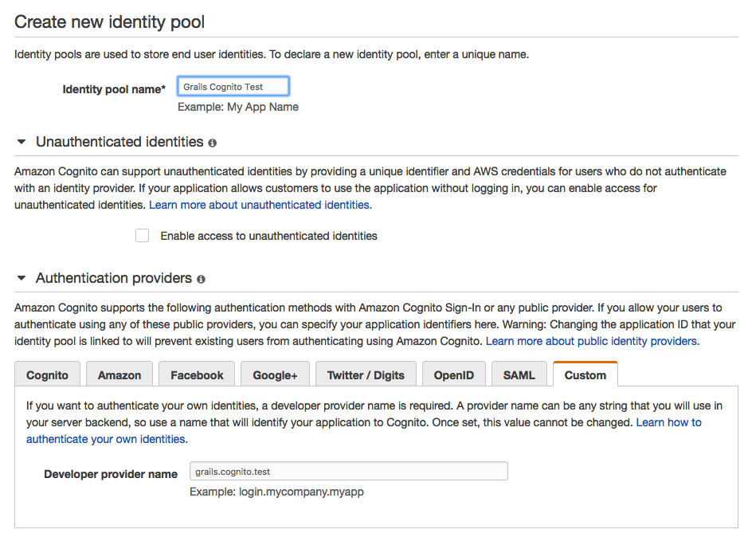

Grails AWS SDK DynamoDB Plugin
==============================

[](https://travis-ci.org/agorapulse/grails-aws-sdk)
[](https://bintray.com/agorapulse/plugins/aws-sdk-dynamodb/_latestVersion)

# Introduction

The [AWS SDK Plugins for Grails3](https://medium.com/@benorama/aws-sdk-plugins-for-grails-3-cc7f910fdc0d#.5gdwdxei3) are a suite of plugins that adds support for the [Amazon Web Services](http://aws.amazon.com/) infrastructure services.

The aim is to to get you started quickly by providing friendly lightweight utility [Grails](http://grails.org) service wrappers, around the official [AWS SDK for Java](http://aws.amazon.com/sdkforjava/) (which is great but very “java-esque”).
See [this article](https://medium.com/@benorama/aws-sdk-plugins-for-grails-3-cc7f910fdc0d#.5gdwdxei3) for more info.

The following services are currently supported:

* [AWS SDK Cognito Grails Plugin](https://github.com/agorapulse/grails-aws-sdk/tree/master/grails-aws-sdk-cognito)
* [AWS SDK DynamoDB Grails Plugin](https://github.com/agorapulse/grails-aws-sdk/tree/master/grails-aws-sdk-dynamodb)
* [AWS SDK Kinesis Grails Plugin](https://github.com/agorapulse/grails-aws-sdk/tree/master/grails-aws-sdk-kinesis)
* [AWS SDK S3 Grails Plugin](https://github.com/agorapulse/grails-aws-sdk/tree/master/grails-aws-sdk-s3)
* [AWS SDK SES Grails Plugin](https://github.com/agorapulse/grails-aws-sdk/tree/master/grails-aws-sdk-ses)
* [AWS SDK SNS Grails Plugin](https://github.com/agorapulse/grails-aws-sdk/tree/master/grails-aws-sdk-sns)
* [AWS SDK SQS Grails Plugin](https://github.com/agorapulse/grails-aws-sdk/tree/master/grails-aws-sdk-sqs)

[Amazon Cognito](https://aws.amazon.com/cognito/) lets you easily add user sign-up and sign-in to your mobile and web apps.
This plugin adds support for creating custom login provider for Cognito Identity Pool.


# Installation

Add plugin dependency to your `build.gradle`:

```groovy
repositories {
    // ...
    maven { url 'http://dl.bintray.com/agorapulse/libs' }
    // ...
}

dependencies {
  // ...
  compile 'org.grails.plugins:aws-sdk-dynamodb:2.1.18'
  // ...
 }
```

# Config

Create an AWS account [Amazon Web Services](http://aws.amazon.com/), in order to get your own credentials accessKey and secretKey.

Create new [Identity Pool](https://console.aws.amazon.com/cognito/create/) 




## Credentials

Add your AWS credentials parameters to your _grails-app/conf/application.yml_:

```yml
grails:
    plugin:
        awssdk:
            accessKey: {ACCESS_KEY}
            secretKey: {SECRET_KEY}
```

If you do not provide credentials, a credentials provider chain will be used that searches for credentials in this order:

* Environment Variables - `AWS_ACCESS_KEY_ID` and `AWS_SECRET_KEY`
* Java System Properties - `aws.accessKeyId and `aws.secretKey`
* Instance profile credentials delivered through the Amazon EC2 metadata service (IAM role)

## Region

The default region used is **us-east-1**. You might override it in your config:

```yml
grails:
    plugin:
        awssdk:
            region: eu-west-1
```

If you're using multiple AWS SDK Grails plugins, you can define specific settings for each services.

```yml
grails:
    plugin:
        awssdk:
            accessKey: {ACCESS_KEY} # Global default setting 
            secretKey: {SECRET_KEY} # Global default setting
            region: us-east-1       # Global default setting
            cognito:
                accessKey: {ACCESS_KEY} # Service setting (optional)
                secretKey: {SECRET_KEY} # Service setting (optional)
                region: eu-west-1       # Service setting (optional)
            
```

## Identity Pool ID

You **have to** provide ID for your identity pool. You can see this value if you switch into _Sample Code_ section on
identity pool's details page. 

 ```yml
 grails:
     plugin:
         awssdk:
             cognito:
                 identityPoolId: "eu-west-1:cafebabe-1111-2222-3333-444455556666"
             
 ```
 
 ## Developer Provider Name
 
 You **have to** provide developer provider name. This is the name you've entered when you've created new Identity Pool.
 
  ```yml
  grails:
      plugin:
          awssdk:
              cognito:
                  developerProviderName: grails.cognito.test
              
  ```

## Salt
**It is crucial to use the same encoding format (`UTF-8`), signature method (`HmacSHA256`) and salt on the client and on the server. 
Otherwise the application won't be able to verify the password correctly.**

Salt configuration only applies if you use `getSaltedPassword(String password, String username, String endpoint)` method
to hash the password. You **should** provide the salt to hash the passoword otherwise combination of username, endpoint 
and application name is used.

  ```yml
  grails:
      plugin:
          awssdk:
              cognito:
                  salt: SaltyHering
              
  ```
## Session Duration

You **can** set the duration of the session for generated token. See [getOpenIdTokenForDeveloperIdentityRequest.withTokenDuration(Long tokenDuration)](http://docs.aws.amazon.com/AWSJavaSDK/latest/javadoc/com/amazonaws/services/cognitoidentity/model/GetOpenIdTokenForDeveloperIdentityRequest.html#withTokenDuration-java.lang.Long-)
for more information

  ```yml
  grails:
      plugin:
          awssdk:
              cognito:
                  sessionDuration: 600 // in seconds, defaults to 15 minutes
              
  ```

# Usage

You can easily create new custom authentication provider from your existing application. You only have to subclass
`AbstractCognitoAuthService`, implement `AuthUser` and `AuthDevice` interfaces and create two controller's actions which 
maps to `/login` and `/gettoken`.

**Inspect [Grails Cognito Auth Demo Application](https://github.com/benorama/grails-cognito-auth) for reference implementation**


## Authentication Service

There are three methods you need to implement in subclasses of `AbstractCognitoAuthService`:

  * `registerDevice` - registers new device
  * `loadDevice` - loads information about authenticated device
  * `loadUser` - loads information about authenticated user
  

Here is minimal implementation of `AbstractCognitoAuthService` taken from [Grails Cognito Auth Demo Application](https://github.com/benorama/grails-cognito-auth) :
 
```groovy
class AuthService extends AbstractCognitoAuthService {

    AuthDeviceDBService authDeviceDBService
    AuthUserDBService authUserDBService

    @Override
    protected boolean registerDevice(String uid, String encryptionKey, String username) {
        authDeviceDBService.register(uid, encryptionKey, username)
    }

    @Override
    protected grails.plugin.awssdk.cognito.AuthDevice loadDevice(String uid) {
        return authDeviceDBService.load(uid)
    }

    @Override
    protected grails.plugin.awssdk.cognito.AuthUser loadUser(String username) {
        return authUserDBService.load(username)
    }

    def getCognitoConfig() {
        grailsApplication.config.grails.plugin.awssdk.cognito
    }
}

```

## Endpoints

You have to map `/login` and `/gettoken` URLs to appropriate controller actions. This plugin doesn't ship with any controller
but it provides helper methods to create your own:

Here is controller and URL mappings taken from [Grails Cognito Auth Demo Application](https://github.com/benorama/grails-cognito-auth) :

```groovy
class AuthController {

    AuthService authService // implementation of AbstractCognitoAuthService

    def login() {
        String resp = authService.doLogin(request, response, params)
        if (resp) {
            render resp
        }
    }

    def token() {
        String resp = authService.doToken(request, response, params)
        if (resp) {
            render resp
        }
    }

}
```

```groovy
class UrlMappings {

    static mappings = {
        // ...
        
        "/login"(controller: "auth", action: "login")
        "/gettoken"(controller: "auth", action: "token")
        
        // ...
    }
}
```

If you already have `/login` URL mapped you can determine the Cognito request by the presence of required parameters:

```groovy
class AuthController {

    AuthService authService // implementation of AbstractCognitoAuthService

    def login() {
        if (params.username && params.timestamp  && params.signature  && params.uid) {
            String resp = authService.doLogin(request, response, params)
            if (resp) {
                render resp
            } else {
                // error has been already sent
                return 
            }
        }
        // continue your usual login flow
    }

}

```


# Bugs

To report any bug, please use the project [Issues](http://github.com/agorapulse/grails-aws-sdk/issues) section on GitHub.

Feedback and pull requests are welcome!